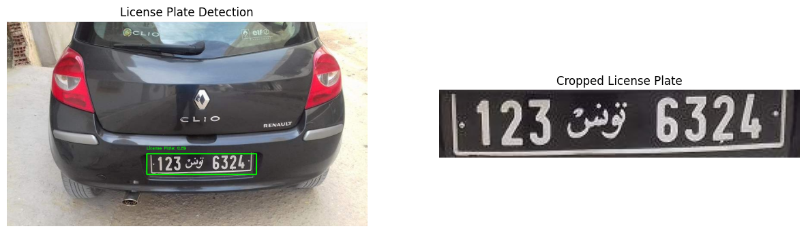

# 🚗 License Plate Detection and Recognition Project 🧬

## 🔍 Project Overview
This project aims to develop a powerful **Deep Learning Model** for detecting and recognizing vehicle license plates. Leveraging the capabilities of **YOLO (You Only Look Once)** for object detection and **EasyOCR** for text recognition, it efficiently identifies and reads license plate information from vehicle images.



## 🎯 Project Goals
- 🚘 **Detect**: Identify the precise location of license plates in images.
- 🔢 **Recognize**: Extract and read the license plate numbers.
- 🏆 **Outcome**: Build a fine-tuned, robust model capable of detecting and recognizing diverse license plates with high accuracy.

## 🛠️ Project Setup

### 1️⃣ Prerequisites
Before you begin, ensure you have the following installed:
- Python 3.7 or higher
- pip (Python package installer)

### 2️⃣ Setting Up a Virtual Environment
It's recommended to create a virtual environment to manage dependencies. You can do this using `venv` or `conda`.

#### Using `venv`
```bash
python -m venv env
source env/bin/activate  # On Windows use env\Scripts\activate
```

#### Using `conda`
```bash
conda create --name license_plate_recognition python=3.7
conda activate license_plate_recognition
```

### 3️⃣ Installing Dependencies
Once your virtual environment is activated, install the required packages:

```bash
pip install -r requirements.txt
```

### 4️⃣ Running the Project
To run the project, execute the following command:
```bash
python main.py
```

## 📄 License
This project is licensed under the MIT License - see the [LICENSE](LICENSE) file for details.


## 📱 Contact
For any inquiries, please contact:
- **Name** - Shubham Damai
- **Email** - [damaishubham14@gmail.com](mailto:damaishubham14@gmail.com)

